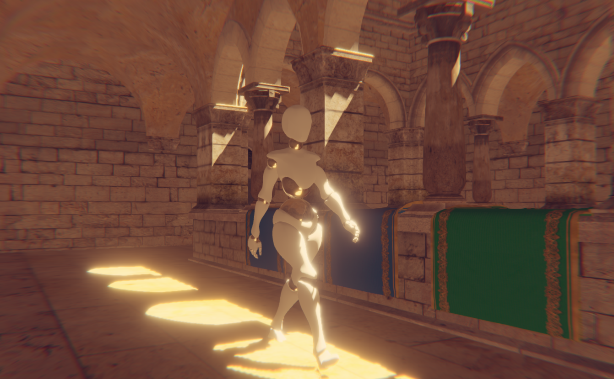

# onecore

OneCore (formerly known as LiteScene) is a scene graph library for WebGL with a component based hierarchical node system.
It comes with a realistic rendering pipeline and some interesting components to make it easier to build and share scenes.

 * Component based node system
 * Realistic rendering pipeline, it supports shadows, reflections, textures for all properties, etc
 * Material system that automatically computes the best shader, making it easy to control properties
 * Resources Manager to load and store any kind of resource ( textures, meshes, etc)
 * Serializing methods to convert any Scene to JSON
 * Parser for most common file formats
 * Easy to embed

 It uses its own low-level library called [litegl.js](https://github.com/jagenjo/litegl.js)




### OnEdit ###

OneCore has been created to work together with [WebGLStudio](https://webglstudio.org), an open source online 3D editor.
From OnEdit you can export the JSON file containing all the info and use it in your OneCore.

### Usage ###

Include the library and dependencies
```html
<script src="external/gl-matrix-min.js"></script>
<script src="external/litegl.min.js"></script>
<script src="js/onecore.js"></script>
```

Create the context
```js
var player = new ONE.Player({
	width:800, height:600,
	resources: "resources/",
	shaders: "data/shaders.xml"
});
```

Attach to Canvas to the DOM:
```js
document.getElementById("mycontainer").appendChild( player.canvas )
```
or you can pass the canvas in the player settings as { canvas: my_canvas_element }

Load the scene and play it:
```js
player.loadScene("scene.json");
```


Documentation
-------------
Check the [guides](guides) folder for a better explanation of how does it works.
The doc folder contains the documentation.
For info about [litegl.js](https://github.com/jagenjo/litegl.js) check the documentation in its repository.
For info about [glMatrix](http://glmatrix.com) check the documentation in its website.

Utils
-----

It includes several commands in the utils folder to generate doc, check errors and build minifyed version.


Feedback
--------

You can write any feedback to javi.agenjo@gmail.com
