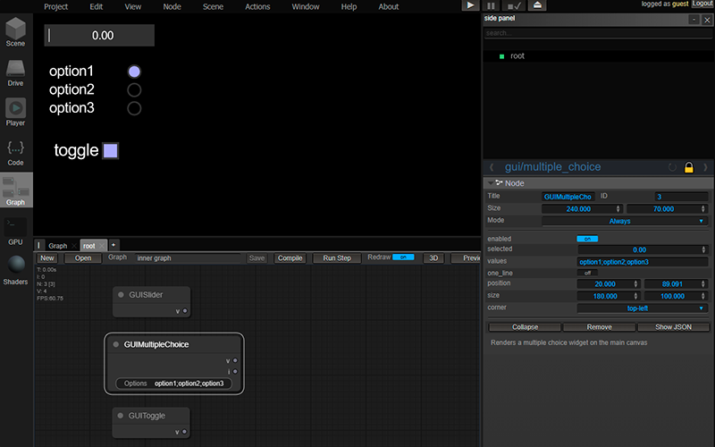

# Creating a GUI on top of your app #

In this chapter we will discuse different ways to create a user interface for you application.

## HTML GUIs

Usually when people start using LiteScene they wonder if the library includes a GUI system to create the interface of their applications. But they ignore that the web already has the best GUI system possible, and it is called HTML.

The only problem is that it requires to know HTML and how the DOM works. 

Use HTML GUIs if you have to display lots of information, or if  you want to use some special character set (japanese characters, etc).

Check the [guide to create GUIs in HTML](gui_html.md) for a tutorial on how to use it.

## Immediate GUI 

The immediate GUI is a set of functions made to help create GUIs very easily. It is similar of how Unity does it.

It works by calling some ```LS.GUI```methods from the ```onRenderGUI``` from a script or after catching the ```renderGUI``` event. Most GUI methods require to pass the area in the form ```[x,y,width,height]``` for the widget, and catching the returned value in case of any interaction could change the value.

The current widgets are:
- ```LS.GUI.Box( area, color )```: to draw a box in the GUI
- ```LS.GUI.Label( area, content )```: to draw a text label (or an image) on the GUI
- ```LS.GUI.Button( area, content, content_over )```: to draw a button (content could be some string or a GL.Texture). Returns true if the button has been pressed.
- ```LS.GUI.TextField( area, text, max_length, is_password )```: to draw a text field widget. Returns the text.
- ```LS.GUI.Toggle( area, value, content, content_off )```: to draw a checkbox (content could be some string or a GL.Texture). Returns the current value of the checkbox (it will be the same as the one passed unless the user clicked the toggle).
- ```LS.GUI.HorizontalSlider( area, value, left_value, right_value, show_value )```: to draw a slider (left_value is min, right_value is max). Returns the current value of the slider (it will be the same as the one passed unless the user clicked the slider).
- ```LS.GUI.VerticalSlider( area, value, left_value, right_value, show_value )```: to draw a slider (left_value is min, right_value is max). Returns the current value of the slider (it will be the same as the one passed unless the user clicked the slider).

As you can see some widgets (like Toggle, TextField or the sliders) return the resulting value. It is important that the returned value gets passed again the next time the widget is rendered. Otherwise the changes wont affect the widget.

There are some interesting variables to tweak the GUI:
- ```LS.GUI.GUIOffset``` is a vec2 that can be changed to position the GUI somewhere else. BUt it must be set every frame.
- ```LS.GUI.GUIStyle``` contains some vars for colors and properties used to stylize the GUI.
- ```LS.GUI.pushStyle()``` if you plan to modify the style, but you want to restore it later.
- ```LS.GUI.popStyle()``` to restore the previous style (recommended if you called pushStyle)

Here is an example of immediate GUI with all the widgets from a Script:

```js
//@immediate gui
//defined: component, node, scene, globals

this.createProperty("texture","", LS.TYPES.TEXTURE );

this.toggle_value = true;
this.slider_value = 50;
this.text = "text";

this.onRenderGUI = function(ctx)
{
	LS.GUI.Box( [5,5,320,600], "#111" );  
  
	LS.GUI.Label( [10,10,300,50], "Example of GUI" );
  
	if( LS.GUI.Button( [10,80,300,50], "Pulsame" ) )
 	{
  		console.log("pulsado!");
	}

	this.text = LS.GUI.TextField( [10,140,300,50], this.text );
	if( LS.GUI.pressed_enter )
    		this.text = "";	

 	this.toggle_value = LS.GUI.Toggle( [10,200,300,50], this.toggle_value, "toggle" );
  
	this.slider_value = LS.GUI.HorizontalSlider( [10,260,300,50], this.slider_value, 0,100, true );

	for(var i = 0; i < 10; ++i)
		this.slider_value = LS.GUI.VerticalSlider( [15 + i * 30,320,24,100], this.slider_value, 0,100 );
  
	LS.GUI.Label( [20,440,100,100], LS.RM.textures[ this.texture ] );
}
```

## Styling the GUI

Here are the fields to change the GUI style:

- **backgroundColor**: "#333"
- **backgroundColorOver**: "#AAA"
- **color**: "#FFF"
- **colorTextOver**: "#FFF"
- **font**: "Arial"
- **margin**: 0.2
- **outline**: "#000"
- **selected**: "#AAF"
- **unselected**: "#AAA"

Remember that if you change any of the vars it will be changed for all the GUI objects in the app. If you just want to change it for one single GUI, then call ```LS.GUI.pushStyle()``` before changing it, and ```LS.GUI.popStyle()``` after rendering your widgets.

## Canvas GUIs

Another option is to create the GUI manually, you can use Canvas2DToWebGL, a library that allows to use regular Canvas2D calls inside the WebGL Canvas, this way you can easily render simple GUIs (more suited for non-interactive GUIs like HUDs).

Also one of the benefits of using Canvas2D is that you can render WebGL textures (even the ones generated by the engine) as part of the interace.

```javascript
this.onRenderGUI = function()
{
  var ctx = gl;
  ctx.start2D();
  ctx.fillStyle = "red";
  ctx.font = "20px Arial";
  ctx.fillText( "Hello", 100,100 );
  ctx.finish2D();
}
```

And if you want to check if the mouse is in a screen position you can use some of the ```LS.Input``` functions:

```javascript
this.onRenderGUI = function()
{
  var ctx = gl;
  ctx.start2D();
  if( LS.Input.Mouse.isInsideRect( 100, 100, 120,80, true ) )
  {
    ctx.canvas.style.cursor = "pointer";
    ctx.fillColor = [0.5,0.5,0.7,0.75];
  }
  else
  {
    ctx.fillColor = [0.2,0.2,0.3,0.75];  
    ctx.canvas.style.cursor = "";
  }  
  ctx.fillText( "Hello", 100,100 );
  ctx.finish2D();
}
```

Check ```LS.Input``` guides for more info of how to handle input.

# Using Graphs

The last option is to use a graph. There are nodes that allow to create widgets on the GUI, check the GUI section in the nodes list.

To get the value you must connect it to the value that must receive the value, remember that you can drag any value from the inspector to the graph, use the circle next to the value.



